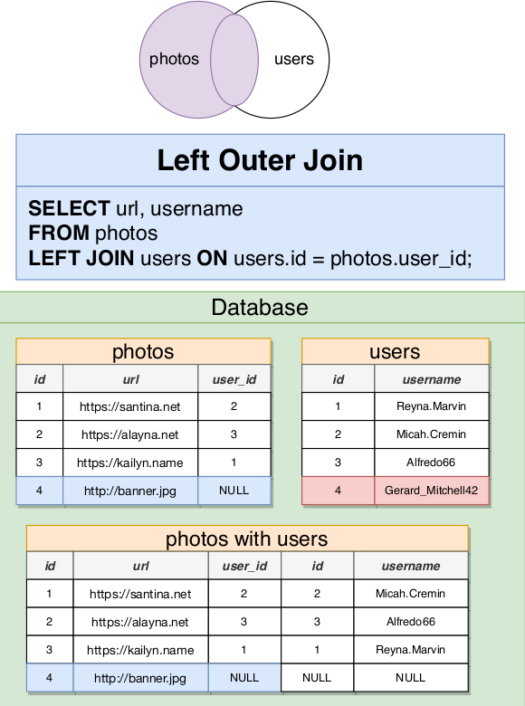
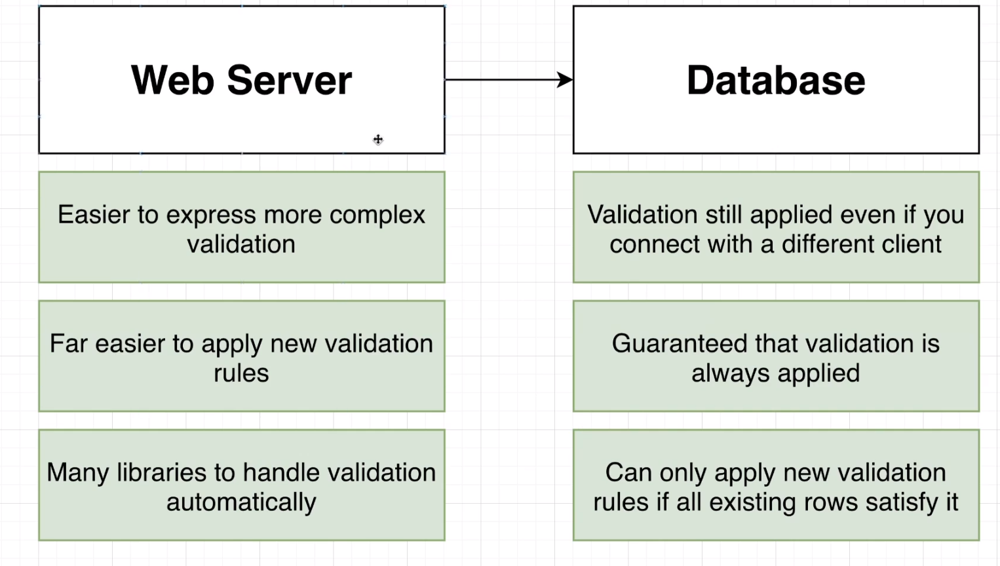

## Overview

  * CMU database course by andy pavlo is a good resource for how the DB engine works internally.
  * This repository is meant to hold notes, code, and diagrams that are implemented/written during studying a course covering postgresSQL.

### Database Design process

  * the first step is to ask what kind of thing we are storing?
  * Then what properties does that thing have?
  * and finally, what type of data does each of those properties contain?

### SQL statement order of execution

  - **FROM**: This is actually the first thing that happens, logically. Before anything else, we’re loading all the rows from all the tables and join them. Before you scream and get mad: Again, this is what happens first logically, not actually. The optimiser will very probably not do this operation first, that would be silly, but access some index based on the WHERE clause. But again, logically, this happens first. Also: all the JOIN clauses are actually part of this FROM clause. JOIN is an operator in relational algebra. Just like + and - are operators in arithmetics. It is not an independent clause, like SELECT or FROM
  - **WHERE**: Once we have loaded all the rows from the tables above, we can now throw them away again using WHERE
  - **GROUP BY**: If you want, you can take the rows that remain after WHERE and put them in groups or buckets, where each group contains the same value for the GROUP BY expression (and all the other rows are put in a list for that group). In Java, you would get something like: Map<String, List<Row>>. If you do specify a GROUP BY clause, then your actual rows contain only the group columns, no longer the remaining columns, which are now in that list. Those columns in the list are only visible to aggregate functions that can operate upon that list. See below.
  - **aggregations**: This is important to understand. No matter where you put your aggregate function syntactically (i.e. in the SELECT clause, or in the ORDER BY clause), this here is the step where aggregate functions are calculated. Right after GROUP BY. (remember: logically. Clever databases may have calculated them before, actually). This explains why you cannot put an aggregate function in the WHERE clause, because its value cannot be accessed yet. The WHERE clause logically happens before the aggregation step. Aggregate functions can access columns that you have put in “this list” for each group, above. After aggregation, “this list” will disappear and no longer be available. If you don’t have a GROUP BY clause, there will just be one big group without any key, containing all the rows.
  - **HAVING**: … but now you can access aggregation function values. For instance, you can check that count(*) > 1 in the HAVING clause. Because HAVING is after GROUP BY (or implies GROUP BY), we can no longer access columns or expressions that were not GROUP BY columns.
  - **WINDOW**: If you’re using the awesome window function feature, this is the step where they’re all calculated. Only now. And the cool thing is, because we have already calculated (logically!) all the aggregate functions, we can nest aggregate functions in window functions. It’s thus perfectly fine to write things like sum(count(*)) OVER () or row_number() OVER (ORDER BY count(*)). Window functions being logically calculated only now also explains why you can put them only in the SELECT or ORDER BY clauses. They’re not available to the WHERE clause, which happened before. Note that PostgreSQL and Sybase SQL Anywhere have an actual WINDOW clause!
  - **SELECT**: Finally. We can now use all the rows that are produced from the above clauses and create new rows / tuples from them using SELECT. We can access all the window functions that we’ve calculated, all the aggregate functions that we’ve calculated, all the grouping columns that we’ve specified, or if we didn’t group/aggregate, we can use all the columns from our FROM clause. Remember: Even if it looks like we’re aggregating stuff inside of SELECT, this has happened long ago, and the sweet sweet count(*) function is nothing more than a reference to the result.
  - **DISTINCT**: Yes! DISTINCT happens after SELECT, even if it is put before your SELECT column list, syntax-wise. But think about it. It makes perfect sense. How else can we remove distinct rows, if we don’t know all the rows (and their columns) yet?
UNION, INTERSECT, EXCEPT: This is a no-brainer. A UNION is an operator that connects two subqueries. Everything we’ve talked about thus far was a subquery. The output of a union is a new query containing the same row types (i.e. same columns) as the first subquery. Usually. Because in wacko Oracle, the penultimate subquery is the right one to define the column name. Oracle database, the syntactic troll ;)
  - **ORDER BY**: It makes total sense to postpone the decision of ordering a result until the end, because all other operations might use hashmaps, internally, so any intermediate order might be lost again. So we can now order the result. Normally, you can access a lot of rows from the ORDER BY clause, including rows (or expressions) that you did not SELECT. But when you specified DISTINCT, before, you can no longer order by rows / expressions that were not selected. Why? Because the ordering would be quite undefined.
  - **OFFSET**: [Don’t use offset](https://blog.jooq.org/2014/08/06/join-the-no-offset-movement/)
  - **LIMIT, FETCH, TOP**: Now, sane databases put the LIMIT (MySQL, PostgreSQL) or FETCH (DB2, Oracle 12c, SQL Server 2012) clause at the very end, syntactically. In the old days, Sybase and SQL Server thought it would be a good idea to have TOP as a keyword in SELECT. As if the correct ordering of SELECT DISTINCT wasn’t already confusing enough.

### SQL relation types: 

  - One-to-many (has many) relationship.
  - Many-to-One relationship.
  - One-to-One relationship.
  - Many-to-Many relationship.

  **Foreign key** deletion constraint:

    * ON DELETE RESTRICT: throw error
    * ON DELETE NO ACTION: throw error
    * ON DELETE CASCADE: delete referenced records as well after deleting the primary record
    * ON DELETE SET NULL: set fk column value to NULL
    * ON DELETE SET DEFAULT: set the fk column to default value if one is provided when creating table

### SQL joins

  * Produces values by merging together rows from different related tables.
  * use a join most times that we are asked to find data that involves multiple resources.

  **Different types of joins**

  

  - **Full Join Type:**

    - Merge tables together, and keep any rows that does not match both tables

  

  - **Inner Join Type**:

  

    - merge tables together and drop any records tha don't match in both tables.
    - Like an intersection with sets.

  - **Left Outer Join Type:**

    - Merge tables together, and keep any rows that does not match only in the **source** table.

  

  - **Right Outer Join Type:**
    
    - Merge tables together, and keep any rows that does not match only in the **join** table.

  

### SQL Aggregations

  * Look at many rows and calculate a single value.
  * Words like `most` `average` are a sign that we need to use an aggregation.

### Notes On sets and sql:
  * When using UNION, the result of the two queries to be unioned, should have the same columns in their results
  * Using UNION ALL allow duplicates between the queries being unioned. 
  * INTERSECT finds the rows common in the results of two queries and removes duplicates
  * INTERSECT ALL finds the rows common in the results of two queries.
  * EXCEPT finds the rows that are present in the first query bot *not* second query (removes duplicates)
  * EXCEPT ALL finds rows that are present in the first query but *not* second query.

### Sub-queries Notes:

  * A sub query could be written in a SELECT, FROM, JOIN, or WHERE clause. This depends on the structure the sub-query returns
  * a sub-query could return a scalar value, many rows and one column, many rows and many columns, and one row and many columns
  * when a sub-query is used in FROM or JOIN clause, it should be always renamed.
  * Validity of sub-queries in WHERE clause depends on the operator and sub-query result structure.
  * A correlated sub-query, is a query that references a value/variable from outer query.
  

### Postgres Data types:

  * These are the main Categories and each category has sub-types:

    - Numbers
    - Currency
    - Binary
    - Date/Time
    - Character
    - JSON
    - Geometric
    - Range
    - Arrays
    - Boolean
    - XML
    - UUID

  **Numbers**:
  

  - for `id` we usually use `serial`.
  - for numbers without decimal point we use `integer`
  - for numbers with high accuracy (like bank accounts and gold grams) we use `numeric`
  - for decimal point number that decimal does not make such a big difference we use `double precision` 
  

  - For floating point math calculations we use `float`, `real`, or `double precision`. These values have inaccuracies in their results but they have better performance when compared to the accurate ones (numeric, decimal)

  **Characters**:
  

  - There is no difference in terms of performance between these types
  - `char` will truncate string or pad a small string with spaces to be of the exact length specified.

  **Boolean**:
  

  - Postgres added the `yes` `y` `1` ... as backward compatible solution for older databases

  **Date and Time**:

  - DATE is used to save just the day, month, and year.
  - for TIME, there are two types:

    1. TIME WITHOUT TIME ZONE
    2. TIME WITH TIME ZONE (saved with the UTC offset)

  **INTERVAL**:

  - usually not used as a column type
  - used when we want to do numeric operations on days, hours, and seconds. So we can subtract or add an INTERVAL to a DATE/TIME type, for example:

    `SELECT('NOV-26-1980 1:23 AM EST'::TIMESTAMP WITH TIME ZONE) - ('1 D'::INTERVAL);`

### Validation on the Database side:

  * We add some constraints on each column of our tables (if necessary).
  * One example is `NOT NULL` constraint, that does not allow null value in a specific column.
  * Some other constraint is the DEFAULT constraint.
  * UNIQUE constraint makes sure that a value being inserted is unique across the entire column (there is also multi column uniqueness constraint).
  * a CHECK constraints are made to check if a value is less/greater/equal ...  than a value (we can compare a value to be inserted with a value in another column). 

  **Where to validate**?

  - Most of validation rules are best put on the server, and only the critical ones are on the database side
  
